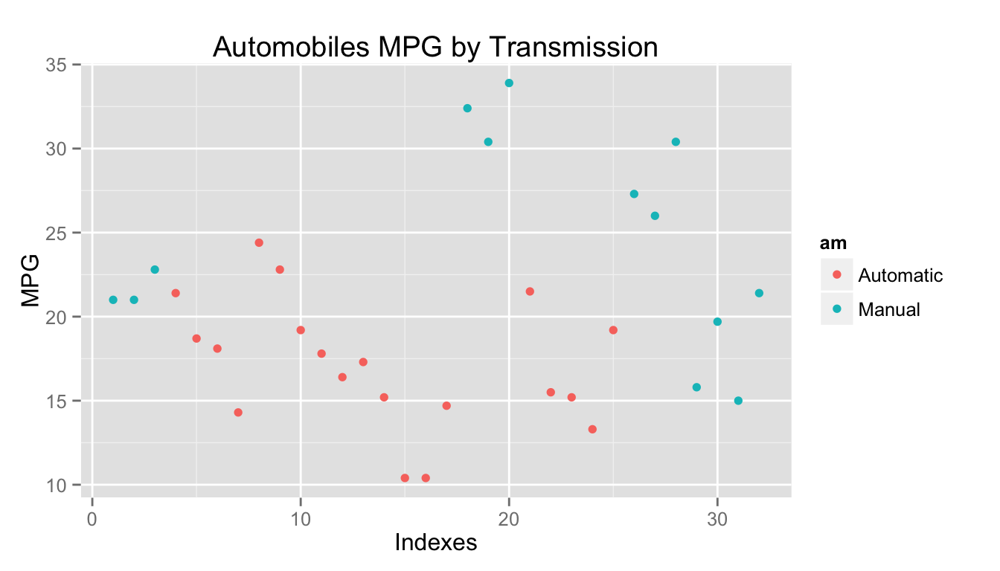
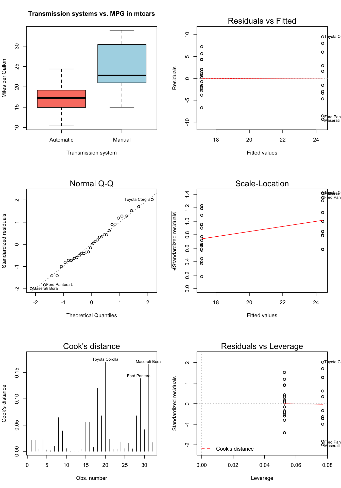

# Regression Model Example

## Summary
This example aims at showing how to use regression techniques to discover existing correlation between parameters in a dataset. The sample `mtcars` dataset from `ggplot2` package will be used for that purpose.
The following two questions about the `mtcars` dataset will be treated: Is an automatic or manual transmission better for MPG (Miles Per Gallon)? and Which is the MPG difference between automatic and manual transmissions?. For accomplishing this task, regression models will be analysed and compared to extract the required information.

Having analysed the data and built the regression models, this analysis proves, with a 95% confidence, that the Manual transmission system is better in terms of Miles per Gallon.

**Acknowledgement**: this tutorial has been largely inspired by David Álvarez Pons' linear modelling example proposed on [RPubs](http://rpubs.com/).
## Exploratory Analysis
The mtcars dataset consists on data extracted from the 1974 Motor Trend US magazine, and comprises fuel consumption and 10 aspects of automobile design and performance for 32 automobiles.

	data(mtcars)
	# str(mtcars) # Shown in appendix

Before starting any modelling, the variables that can influence (or at least have some relation with the topic) in the work of this report are:

- mpg: Miles/gallon
- am: Transmission (0 = automatic, 1 = manual)
- gear: Number of forward gears

Let's perform some changes in the data set to ease the displaying of information and data modelling.

	mtcars$am <- factor(mtcars$am)
	levels(mtcars$am) <- c("Automatic", "Manual")

We do not consider the gear variable as a factor explicitly, since it is a representation of a quantity of gears, not different categories or levels.

## Regression Modelling
First of all we build the obvious model without any data transformation and all the considered variables. Then, we will analyze its results in order to see if the model can be improved or some data transformation will improve it.

	fit1 <- lm(mpg ~ am + gear, mtcars)
	# summary(fit1)$coef # Shown in appendix
Now, let's compare it with a regression model considering only the Transmission system variable as a regressor for the Miles per Gallon outcome.

	fit2 <- lm(mpg ~ am, mtcars)
	# summary(fit2)$coef # Shown in appendix
Since the p-value for the gear coefficient is 0.9651, we can conclude that this variable is not providing much information to the regression. Hence, we proceed with the second model without the gear variable.

In the model fit2, the coefficients represent the difference between the Automatic and Manual transmission system. To make more explicit the actual values of each transmission system let's remove the automatic intercept from the model.

	fit3 <- lm(mpg ~ am - 1, mtcars)
	# summary(fit3)$coef # Shown in appendix
The results of the fit3 model show the same as the boxplots available in the appendix. The Automatic transmission system has a mean of 17.1474 miles per gallon with a standard error of 1.1246 whilst the Manual transmission results in 24.3923 miles per gallon with a standard error of 1.3596.

However, the questions of interest in this report are regarding the difference between the two types of transmission systems. Therefore, the further analysis will consider the fit2 model in which the intercept represents the average of the Automatic transmission and the slope the difference with Manual transmission.

## Residuals and diagnosis
In this section the chosen model, fit2 will be analysed in terms of residuals and diagnosis.

The residuals of a good model should be uncorrelated with its fitted values, having a distribution around a zero mean. This can be seen in the Residuals vs Fitted plot in the appendix and we will see it numerically next.

	cor_res_fit <- cor(resid(fit2), predict(fit2))
	mean_res <- mean(resid(fit2))
	sd_res <- sd(resid(fit2))
As stated above, the residuals and the fitted values are uncorrelated with a correlation of 0. The residuals have a mean of 0 and a standard deviation of 4.8223.

The other plots in the appendix show other properties of the residuals and leverage of the fitted model.

## Conclusions
According to the chosen regression model, fit2, the Manual transmission system provides a better Miles per Gallon ratio than the Automatic transmission system. With a 95% confidence, the difference in consumption is in the following interval.

	sfit <- summary(fit2)
	alpha <- 0.05
	df <- sfit$df[2]
	se <- sfit$coef[2, 2]
	diff <- sfit$coef[2, 1]
	diff + c(-1, 1) * qt(1-alpha/2, df) * se # Confidence interval
	## [1]  3.64151 10.84837
This interval shows that the Manual transmission system is better than the Automatic transmission in terms of consumption.

## Appendix

	str(mtcars)
	## 'data.frame':    32 obs. of  11 variables:
	##  $ mpg : num  21 21 22.8 21.4 18.7 18.1 14.3 24.4 22.8 19.2 ...
	##  $ cyl : num  6 6 4 6 8 6 8 4 4 6 ...
	##  $ disp: num  160 160 108 258 360 ...
	##  $ hp  : num  110 110 93 110 175 105 245 62 95 123 ...
	##  $ drat: num  3.9 3.9 3.85 3.08 3.15 2.76 3.21 3.69 3.92 3.92 ...
	##  $ wt  : num  2.62 2.88 2.32 3.21 3.44 ...
	##  $ qsec: num  16.5 17 18.6 19.4 17 ...
	##  $ vs  : num  0 0 1 1 0 1 0 1 1 1 ...
	##  $ am  : Factor w/ 2 levels "Automatic","Manual": 2 2 2 1 1 1 1 1 1 1 ...
	##  $ gear: num  4 4 4 3 3 3 3 4 4 4 ...
	##  $ carb: num  4 4 1 1 2 1 4 2 2 4 ...

	summary(fit1)
	## 
	## Call:
	## lm(formula = mpg ~ am + gear, data = mtcars)
	## 
	## Residuals:
	##     Min      1Q  Median      3Q     Max 
	## -9.4465 -3.0584 -0.2788  3.2740  9.5416 
	## 
	## Coefficients:
	##             Estimate Std. Error t value Pr(>|t|)  
	## (Intercept) 16.86468    6.51167   2.590   0.0149 *
	## amManual     7.14156    2.95229   2.419   0.0221 *
	## gear         0.08805    1.99669   0.044   0.9651  
	## ---
	## Signif. codes:  0 '***' 0.001 '**' 0.01 '*' 0.05 '.' 0.1 ' ' 1
	## 
	## Residual standard error: 4.986 on 29 degrees of freedom
	## Multiple R-squared:  0.3598, Adjusted R-squared:  0.3157 
	## F-statistic: 8.151 on 2 and 29 DF,  p-value: 0.001553

	summary(fit2)
	## 
	## Call:
	## lm(formula = mpg ~ am, data = mtcars)
	## 
	## Residuals:
	##     Min      1Q  Median      3Q     Max 
	## -9.3923 -3.0923 -0.2974  3.2439  9.5077 
	## 
	## Coefficients:
	##             Estimate Std. Error t value Pr(>|t|)    
	## (Intercept)   17.147      1.125  15.247 1.13e-15 ***
	## amManual       7.245      1.764   4.106 0.000285 ***
	## ---
	## Signif. codes:  0 '***' 0.001 '**' 0.01 '*' 0.05 '.' 0.1 ' ' 1
	## 
	## Residual standard error: 4.902 on 30 degrees of freedom
	## Multiple R-squared:  0.3598, Adjusted R-squared:  0.3385 
	## F-statistic: 16.86 on 1 and 30 DF,  p-value: 0.000285

	summary(fit3)
	## 
	## Call:
	## lm(formula = mpg ~ am - 1, data = mtcars)
	## 
	## Residuals:
	##     Min      1Q  Median      3Q     Max 
	## -9.3923 -3.0923 -0.2974  3.2439  9.5077 
	## 
	## Coefficients:
	##             Estimate Std. Error t value Pr(>|t|)    
	## amAutomatic   17.147      1.125   15.25 1.13e-15 ***
	## amManual      24.392      1.360   17.94  < 2e-16 ***
	## ---
	## Signif. codes:  0 '***' 0.001 '**' 0.01 '*' 0.05 '.' 0.1 ' ' 1
	## 
	## Residual standard error: 4.902 on 30 degrees of freedom
	## Multiple R-squared:  0.9487, Adjusted R-squared:  0.9452 
	## F-statistic: 277.2 on 2 and 30 DF,  p-value: < 2.2e-16

